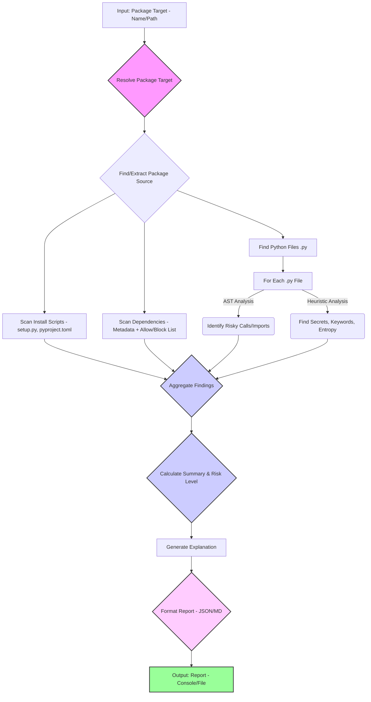

# 🕵️ SherlockScan: Investigate Your Python Dependencies!

[](https://opensource.org/licenses/MIT)
[](https://pypi.org/project/sherlockscan/)
[](https://travis-ci.com/yourusername/sherlockscan)
[](https://codecov.io/gh/yourusername/sherlockscan)

**Uncover hidden risks lurking within your Python packages before they compromise your projects — especially crucial for Data Science, Machine Learning, and regulated environments.**

---

## ❓ The Mystery: What's Hiding in Your Dependencies?

In the world of software development, especially in Python's rich ecosystem, we often rely on third-party packages from sources like PyPI. We `pip install` them, trusting they do what they claim. But what if they do *more*?

Imagine inviting a helpful stranger into your house. They might fix your plumbing, but they might also secretly copy your keys or map out your valuables. Similarly, Python packages can contain:

* **Malicious Code:** Viruses, ransomware, or spyware hiding within seemingly useful functions.
* **Hidden Backdoors:** Secret ways for attackers to access your systems later.
* **Leaked Secrets:** Hardcoded API keys, passwords, or tokens accidentally left in the code.
* **Unexpected Behavior:** Code that sends your data to unknown servers or runs cryptocurrency miners during your ML training jobs.

These "supply chain attacks" are a growing threat. Regulated industries like banking and healthcare, and sensitive fields like AI/ML dealing with valuable data and models, *cannot afford* to be compromised by a dependency.

---

## 🔍 Enter SherlockScan: Your Code Detective

SherlockScan acts like a detective for your Python dependencies. It doesn't just check for known vulnerabilities (like a standard security guard checking an ID list); it actively investigates the *code itself* to find suspicious patterns, hidden logic, and potential malice *before* you integrate it deeply into your projects.

It's designed with **Data Science and Machine Learning** workflows in mind, looking for risks particularly relevant to data handling, model integrity, and common DS/ML libraries — but its core analysis is valuable for any Python project.

---

## ✨ Key Features

* **📜 Static Code Analysis (AST):** Parses Python code to understand its structure and identify dangerous function calls (`eval`, `exec`, `pickle.load`, `os.system`, `subprocess`), risky imports (networking, ctypes), and suspicious patterns relevant to DS/ML.
* **🕵️ Heuristic Scanning:** Uses configurable rules (regex, keywords, entropy analysis) to find hardcoded secrets (API keys, passwords for AWS, GCP, Azure, common SaaS platforms), suspicious comments, and potentially obfuscated code.
* **🔗 Dependency Vetting:** Checks a package's direct dependencies against configurable `allow` and `block` lists, ensuring you only rely on approved packages.
* **📦 Installation Script Analysis:** Examines `setup.py` and `pyproject.toml` for commands or custom build steps that might execute malicious code during installation.
* **⚙️ Configurable Rules:** Easily customize detection patterns, keywords, severity levels, and approved dependencies via simple YAML files (`risk_patterns.yaml`, `approved_packages.yaml`).
* **📄 Multiple Report Formats:** Generates human-readable Markdown reports and machine-readable JSON reports.
* **🗣️ Explainable Results:** Provides clear messages explaining *why* something was flagged and an overall risk assessment with recommendations.
* **💻 CLI & Library:** Use it as a command-line tool or integrate its scanning functions into your own Python scripts and CI/CD pipelines.

---

## 🤔 Why SherlockScan?

While other tools exist (like SAST and SCA scanners), SherlockScan aims to fill a specific niche:

1. **Focus on *Intent* & Hidden Logic:** Goes beyond known CVEs to look for patterns *suggesting* malicious intent or dangerous practices (like network calls on import, obfuscation, setup script execution).
2. **DS/ML Context Aware (Planned):** While the core is general, future development aims to add more checks relevant to data leakage, model tampering, and common ML library vulnerabilities.
3. **Explainability:** Provides clearer context on *why* a pattern is considered risky.
4. **Configuration Flexibility:** Easily tailor detection rules to your organization's specific needs and risk tolerance without complex setup.

---

## ⚙️ How It Works: The Investigation Process

SherlockScan follows a multi-stage process to analyze a target package:



**Stage-by-stage breakdown:**

1. **Resolve Package Target:** Determines if the input is a local directory, an archive file, or a package name from PyPI. Downloads and extracts if necessary using `pip download` and standard archive libraries. Finds the package source root.
2. **Scan Install Scripts:** Analyzes `setup.py` (using AST) and `pyproject.toml` (using TOML parsing) for risky commands or configurations executed during build/installation.
3. **Scan Dependencies:** Parses package metadata (using `importlib.metadata` on the installed package) to find direct dependencies. Checks these against `approved_packages.yaml`.
4. **Scan Source Files:** Recursively finds all `.py` files.
5. **AST Analysis:** Parses each file into an Abstract Syntax Tree. Traverses the tree to find specific function calls (`eval`, `pickle.load`, `os.system`, etc.) and module imports (`requests`, `socket`, `subprocess`, etc.) defined as risky.
6. **Heuristic Analysis:** Reads each file line-by-line. Applies regex patterns (from `risk_patterns.yaml`) to detect secrets. Checks for suspicious keywords. Calculates Shannon entropy to flag potentially obfuscated lines/strings.
7. **Aggregate & Report:** Collects all findings from all stages. Calculates a summary (counts by severity) and determines an overall risk level. Generates a human-readable explanation. Formats the final report in JSON or Markdown.

---

## 🚀 Installation

Ensure you have Python 3.8+ installed. You can install SherlockScan using pip:

```bash
pip install sherlockscan
```

Or install directly from source:

```bash
git clone https://github.com/yourusername/sherlockscan.git  # TODO: Update URL
cd sherlockscan
pip install .
```

SherlockScan requires the following libraries, which are installed automatically:

* `typer` (for the CLI)
* `PyYAML` (for configuration files)
* `packaging` (for dependency parsing)
* `toml` (for `pyproject.toml` parsing)

---

## 💻 Usage

### Command Line Interface (CLI)

The primary way to use SherlockScan is via the `sherlockscan` command:

```bash
sherlockscan scan <package_target> [OPTIONS]
```

**Arguments:**

* `PACKAGE_TARGET`: *(Required)* The package to scan. This can be:
  * A package name from PyPI (e.g., `requests`)
  * A path to a local directory containing the package source
  * A path to a local archive file (`.whl`, `.tar.gz`, `.zip`)

**Options:**

| Flag | Description |
|------|-------------|
| `-o, --output PATH` | Path to save the report file. If omitted, the report is printed to the console. |
| `-f, --format [json\|md]` | Output format. Default is `md` (Markdown). |
| `-c, --config PATH` | Path to the directory containing configuration files (`risk_patterns.yaml`, `approved_packages.yaml`). Defaults to `./config`. |
| `-s, --severity [CRITICAL\|HIGH\|MEDIUM\|LOW\|INFO]` | Minimum severity level to report. Default is `INFO` (shows all). |

**Examples:**

```bash
# Scan 'requests' from PyPI, print Markdown report to console (showing all findings)
sherlockscan scan requests

# Scan a local package directory, save JSON report, show only HIGH severity or above
sherlockscan scan ./my_local_package/ -f json -o report.json -s HIGH

# Scan a downloaded wheel file using custom config, print MD to console
sherlockscan scan ./downloads/some_package-1.0-py3-none-any.whl -c ./my_configs/
```

---

### Library Usage

You can also integrate SherlockScan's core logic into your own Python scripts.

> ⚠️ **Note:** The library API is less stable in early versions and may change.

```python
import os

from sherlockscan import utils
from sherlockscan.scanner import ast_scanner, heuristics, deps, install_script_analyzer
from sherlockscan.scanner import explainer
from sherlockscan.report import json_formatter  # or markdown_formatter

# 1. Resolve the package target to get its source directory, name, version.
#    WARNING: The current implementation returns a path in a temp dir
#    which needs manual cleanup after use.
try:
    if hasattr(utils, 'resolve_package_target') and callable(utils.resolve_package_target):
        pkg_dir, pkg_name, pkg_version = utils.resolve_package_target("requests")
    else:
        raise ImportError("utils.resolve_package_target not found or not callable.")
except Exception as e:
    print(f"Error resolving package: {e}")
    exit()

# Define config paths
config_dir = "./config"  # Or your custom path
risk_patterns_path = os.path.join(config_dir, "risk_patterns.yaml")
approved_packages_path = os.path.join(config_dir, "approved_packages.yaml")

# 2. Run scanners
all_findings = []
all_findings.extend(install_script_analyzer.scan_install_scripts(str(pkg_dir)))

if hasattr(deps, 'scan_dependencies') and callable(deps.scan_dependencies):
    all_findings.extend(deps.scan_dependencies(pkg_name, approved_packages_path))
else:
    print("Warning: Dependency scanner not found.")

if hasattr(utils, 'find_python_files') and callable(utils.find_python_files):
    python_files = utils.find_python_files(pkg_dir)
    for py_file in python_files:
        all_findings.extend(ast_scanner.scan_file_ast(str(py_file)))
        all_findings.extend(heuristics.scan_file_heuristics(str(py_file), risk_patterns_path))
else:
    print("Warning: Python file finder not found.")

# 3. Process results
# summary = _calculate_summary(all_findings)
# overall_risk_level = _determine_overall_risk(summary)
# explanation = explainer.generate_overall_explanation(...)

# 4. Format report
# json_report = json_formatter.format_report_json(...)

# Remember to clean up temporary directories created by resolve_package_target!
```

---

## 🔧 Configuration

SherlockScan uses YAML files in a configuration directory (default `./config/`) for customization.

### `risk_patterns.yaml`

* Defines regex patterns for secret detection (e.g., API keys, passwords).
* Defines suspicious keywords to search for in code and comments.
* Sets the `entropy_threshold` for detecting potentially obfuscated code.
* Allows specifying `type`, `severity`, and `message` for each pattern/keyword.

```yaml
settings:
  entropy_threshold: 4.0

regex_patterns:
  - name: AWS Access Key ID
    type: Hardcoded Secret
    pattern: '(A3T[A-Z0-9]|AKIA|...)[A-Z0-9]{16}'
    severity: CRITICAL
    message: "Potential AWS Access Key ID detected."
  # ... more patterns

keywords:
  - name: TODO Security
    type: Security Comment
    keyword: "TODO: security"
    severity: LOW
    message: "Comment indicates a potential security task."
  # ... more keywords
```

### `approved_packages.yaml` *(Optional)*

* Defines an **allowlist** of explicitly approved dependency package names. If present and non-empty, any dependency not on this list will be flagged.
* Defines a **blocklist** of explicitly forbidden dependency package names. Any dependency on this list will be flagged with high severity.
* Package names are canonicalized (lowercase, hyphens) before comparison.

```yaml
allowlist:
  - numpy
  - pandas
  - requests
  # ... more approved packages

blocklist:
  - malicious-lib
  - outdated-insecure-package
  # ... more blocked packages
```

---

## 📊 Output Formats

SherlockScan provides two output formats:

* **Markdown (`md`):** *(Default)* Human-readable report suitable for documentation, manual review, or pasting into issues/wikis. Includes a summary table and detailed findings with code snippets.
* **JSON (`json`):** Machine-readable format suitable for integration with other tools, dashboards, or automated processing. Contains all report details in a structured format.

```json
{
  "package_name": "example-package",
  "package_version": "1.0.0",
  "scan_timestamp": "2025-04-13T21:00:00Z",
  "overall_risk_level": "CRITICAL",
  "findings": [
    {
      "type": "Hardcoded Secret",
      "severity": "CRITICAL",
      "file_path": "src/config.py",
      "line_number": 15,
      "code_snippet": "API_KEY = \"sk_live_...\"",
      "message": "Potential Stripe API Key detected."
    }
  ],
  "summary": {
    "total_findings": 5,
    "by_severity": { "CRITICAL": 1, "HIGH": 2, "MEDIUM": 1, "LOW": 1 }
  },
  "explanation": "Package analysis resulted in overall risk level CRITICAL..."
}
```

---

## 🤝 Contributing

Contributions are welcome. Please see CONTRIBUTING.md for guidelines on reporting issues, proposing features, and submitting pull requests.

Key areas for contribution:

* Adding more detection rules (regex, keywords, AST patterns)
* Improving accuracy and reducing false positives of existing rules
* Enhancing the `resolve_package_target` utility for better robustness
* Adding support for analyzing C extensions
* Developing dynamic analysis (sandboxing) capabilities
* Improving report formatting and explainability
* Adding more tests!

---

## 📜 License

This project is licensed under the **MIT License** — see the `LICENSE` file for details.
